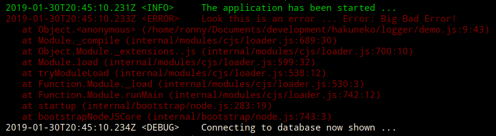
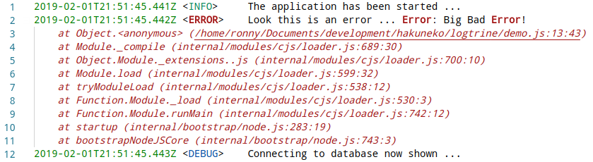

# Table of Content

- [Quick Start](#quick-start)
  - [ConsoleLogger](consolelogger)
  - [FileLogger](filelogger)
- [General](#general)
  - [Log Levels](#log-levels)
  - [Log Methods](#log-methods)
  - [Log Chaining](#log-chaining)

# Quick Start

> No bells and whistles, just a simple logger!

The module `logtrine` is an object-oriented logger, based on an interface and currently providing two implementations:
- The `ConsoleLogger` which writes messages to the standard output
- The `FileLogger` which writes messages to a log file

Features:
- A log level can be set at any time to limit/filter the written log message types
- Each log message is prefixed with the ISO time and a tag indicating the log level
- Loggers can be 'chained' to write a log message to multiple targets with a single call

[back to top](#table-of-content)

## ConsoleLogger

```javascript
// Include the module and create an instance with debug level <Info>
const { ConsoleLogger } = require('logtrine');
var logger = new ConsoleLogger(ConsoleLogger.LEVEL.Info);

// This will be shown on the terminal in default color
logger.info('The application has been started ...');

// This will be shown on the terminal in red
logger.error('Look this is an error ...', new Error('Big Bad Error!'));

// This will not be shown, because the logger was initialized with log level <Info>
logger.debug('Connecting to database ...');

// Lets change the log level on the fly
logger.level = ConsoleLogger.LEVEL.Debug;

// Now debug message written with this logger instance will be shown
logger.debug('Connecting to database now shown ...');
```

Output:



[back to top](#table-of-content)

## FileLogger

```javascript
// Include the module and create an instance with debug level <Info>
const { FileLogger } = require('logtrine');
var logger = new FileLogger('/tmp/logtrine.log', FileLogger.LEVEL.Info);

// This will delete all content of the log file
logger.clear();

// This will add a log message to the log file
logger.info('The application has been started ...');

// This will add a log message to the log file
logger.error('Look this is an error ...', new Error('Big Bad Error!'));

// This will not be added, because the logger was initialized with log level <Info>
logger.debug('Connecting to database ...');

// Lets change the log level on the fly
logger.level = FileLogger.LEVEL.Debug;

// Now debug message written with this logger instance will be added
logger.debug('Connecting to database now shown ...');
```

Output:



[back to top](#table-of-content)

# General

...

[back to top](#table-of-content)

## Log Levels

The following log levels are available:

```javascript
const { ConsoleLogger } = require('logtrine');
var logger = new ConsoleLogger(); // default level is <Info>

// Only messages that are logged with a level equal or higher
// to the current log level will be shown
// The following log levels are ordered ascending
logger.level = ConsoleLogger.LEVEL.All;
logger.level = ConsoleLogger.LEVEL.Trace;
logger.level = ConsoleLogger.LEVEL.Debug;
logger.level = ConsoleLogger.LEVEL.Verbose;
logger.level = ConsoleLogger.LEVEL.Info;
logger.level = ConsoleLogger.LEVEL.Warn;
logger.level = ConsoleLogger.LEVEL.Error;
logger.level = ConsoleLogger.LEVEL.Critical;
logger.level = ConsoleLogger.LEVEL.None; // disables all log messages
```

[back to top](#table-of-content)

## Log Methods

The following methods can be used to log data for the corresponding level.
Each method supports a variable number of input parameters of any type:

```javascript
const { ConsoleLogger } = require('logtrine');
var logger = new ConsoleLogger(ConsoleLogger.LEVEL.All);

logger.trace('message ...');
logger.debug('message ...');
logger.verbose('message ...');
logger.info('message ...');
logger.warn('message ...', 'memory low');
logger.error('message ...', new Error());
logger.critical('message ...', new Error());
```

[back to top](#table-of-content)

## Log Chaining

Sometimes a log message shall be logged to multiple targets (e.g. console + file or fileA + fileB). This is where logger chaining comes into the picture.

```javascript
// Include the module and create an instance with log level <Info>
const { ConsoleLogger, FileLogger } = require('./src/logtrine.js');
var logger = new ConsoleLogger(ConsoleLogger.LEVEL.Info, new FileLogger('/tmp/logtrine.log'));

// The chained logger can be accessed through the logger property
// Lets clear the log file of the chained logger
logger.logger.clear();

// This message will be written to the console and to the log file
logger.info('The application has been started ...');

// Changing a level will also affect a level change on all chained loggers
logger.level = FileLogger.LEVEL.Debug;

// This will appear on the console and in the log file
logger.info('Show this in console and log file ...');

// If you really want the chained logger to have a different log level set it afterwards
logger.logger.level = FileLogger.LEVEL.Warn;

// This will appear on the console, but not in the log file
logger.info('Only show this on the console ...');

// A chained logger can be detached by setting the null reference
logger.logger = null;

// No chained logger exists anymore, output only to console
logger.warn('Only show this on the console ...');
```

[back to top](#table-of-content)