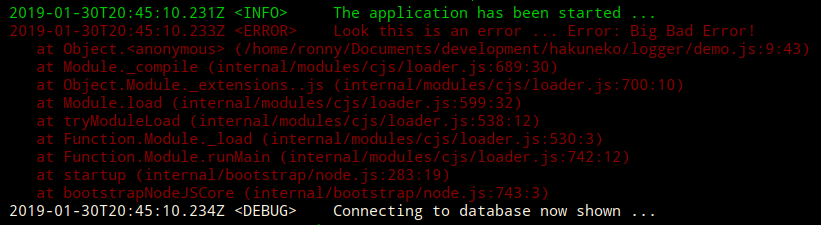

# Table of Content

- [Quick Start](#quick-start)
  - [Log Levels](#log-levels)
  - [Log Methods](#log-methods)

# Quick Start

> No bells and whistles, just a simple logger!

The module `logtrine` is based on a logging interface and currently provides a single implementation , the `ConsoleLogger`, that supports writing different log message types to the standard output.

Furthermore a log level can be set to show only log message types of the given level or above. In addition, each message is prefixed with the ISO time and a tag that indicates the log level of the message.

```javascript
// Include the module and create an instance with debug level <Info>
const { ConsoleLogger } = require('logtrine');
var logger = new ConsoleLogger(ConsoleLogger.LEVEL.Info);

// This will be shown on the terminal in default color
logger.info('The application has been started ...');

// This will be shown on the terminal in red
logger.error('Look this is an error ...', new Error('Big Bad Error!'));

// This will not be shown, because the logger was initialized with log level <Info>
logger.debug('Connecting to database ...');

// Lets change the log level on the fly
logger.level = ConsoleLogger.LEVEL.Debug;

// Now debug message written with this logger instance will be shown
logger.debug('Connecting to database now shown ...');
```

Output:



## Log Levels

The following log levels are available:

```javascript
const { ConsoleLogger } = require('logtrine');
var logger = new ConsoleLogger(); // default level is <Info>

// Only messages that are logged with a level equal or higher
// to the current log level will be shown
// The following log levels are ordered ascending
logger.level = ConsoleLogger.LEVEL.All;
logger.level = ConsoleLogger.LEVEL.Trace;
logger.level = ConsoleLogger.LEVEL.Debug;
logger.level = ConsoleLogger.LEVEL.Verbose;
logger.level = ConsoleLogger.LEVEL.Info;
logger.level = ConsoleLogger.LEVEL.Warn;
logger.level = ConsoleLogger.LEVEL.Error;
logger.level = ConsoleLogger.LEVEL.Critical;
logger.level = ConsoleLogger.LEVEL.None; // disables all log messages
```

## Log Methods

The following methods can be used to log data for the corresponding level.
Each method supports a variable number of input parameters of any type:

```javascript
const { ConsoleLogger } = require('logtrine');
var logger = new ConsoleLogger(ConsoleLogger.LEVEL.All);

logger.trace('message ...');
logger.debug('message ...');
logger.verbose('message ...');
logger.info('message ...');
logger.warn('message ...', 'memory low');
logger.error('message ...', new Error());
logger.critical('message ...', new Error());
```

[back to top](#table-of-content)

---

